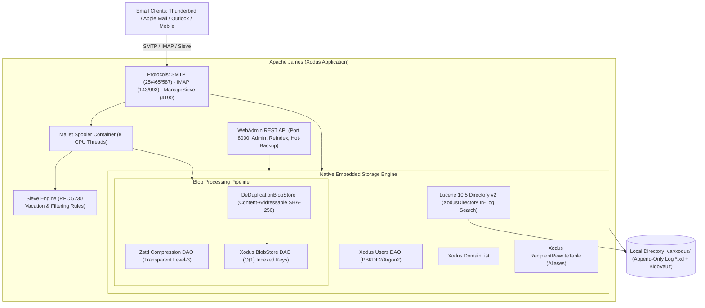

# ⚡ Apache James :: Xodus Server (High-Performance Embedded Mail Server)

[](https://openjdk.org/)
[](https://github.com/JetBrains/xodus)
[](https://lucene.apache.org/)
[](https://facebook.github.io/zstd/)
[](https://github.com/apache/james-project)
[]()
[]()

**Apache James Xodus Server** is an ultra-fast, lightweight, fully self-contained next-generation mail server.

Unlike traditional enterprise James distributions that require heavyweight external DBMS engines (PostgreSQL, Cassandra, MySQL), distributed queue brokers (RabbitMQ), and external search clusters (ElasticSearch/OpenSearch), this server operates **100% embedded and native**. It is powered by the transactional embedded transactional KV / Entity Store engine **JetBrains Xodus 3.1**, full-text search engine **Apache Lucene 10.5**, and streaming compressed blob store with **Zstandard (Zstd)** deduplication.

---

---

## 💡 Why Apache James on JetBrains Xodus? (vs JPA-App & Postgres-App)

Apache James historically offers distribution variants such as **James JPA-App** (using OpenJPA/Hibernate with Derby, H2, or MySQL) and **James Postgres-App** (using PostgreSQL with external drivers). While they leverage familiar relational databases, their relational mapping and external client-server topologies introduce massive architectural penalties under heavy email workloads.

`xodus-app` fundamentally outperforms both:

| Dimension | 🐢 Traditional `jpa-app` (Derby / H2 / MySQL) | 🐘 Enterprise `postgres-app` (PostgreSQL) | **⚡ Native `xodus-app` (JetBrains Xodus 3.1)** |
| :--- | :--- | :--- | :--- |
| **Runtime Architecture** | Embedded SQL engine or separate RDBMS daemon | Multi-process client/server (Postgres daemon + PgBouncer) | **100% Embedded Single-Process (`java -jar`)** |
| **Data Access Layer** | Heavy JPA/ORM reflection, dirty checking, session flush | JDBC socket overhead, wire protocol encoding/decoding | **Zero-overhead B-Tree pointer traversal & Memory-Mapped Log** |
| **Disk Storage Model** | Random 4K page overwrites, heavy B-Tree rebalancing | Table pages + MVCC bloat (`VACUUM` required) + WAL | **Append-Only Sequential Log (`.xd`), zero random block thrashing** |
| **Hardware SSD / HDD Wear** | Severe write amplification from frequent table fsyncs | Synchronous WAL checkpoints & random table page writes | **Universal Low-Wear Profile (`logSyncPeriod=2000`, 16 MB chunks)** |
| **Blob & Attachment I/O** | Large byte arrays loaded into JVM Heap or SQL LOBs | Hex/Bytea encoding over TCP socket; heavy network hops | **Native `FileSystemBlobVault` stream + Transparent Zstd Compression** |
| **Attachment Deduplication** | None (duplicate attachments stored per recipient/folder) | Manual custom schema or heavy object storage integration | **Native SHA-256 CAS Deduplication + V2 In-Place Periodic Deduplication** |
| **Full-Text Search** | SQL `LIKE '%term%'` full-table scans or Lucene on FS | Postgres `tsvector` / GIN indexes (heavy write latency) | **Embedded Lucene 10.5 in unified Xodus transactional log** |
| **Crash Recovery & ACID** | Fragile file-based locks; corrupted table indexes on power loss | WAL replay with checkpoints (can take minutes to boot) | **Instant zero-loss MVCC recovery: atomic snapshot tail discard** |
| **RAM Footprint (Idle / Load)**| 2 GB idle / 6–8 GB peak under concurrency | 3 GB idle / 6–10 GB peak (JVM + Postgres shared buffers) | **< 1.2 GB idle / 4 GB peak under 20 concurrent threads** |
| **Operational Simplicity** | Database driver configs, dialect bugs, ORM migration scripts | DBA required: connection pools, VACUUM maintenance, replication | **Zero DBA, zero config: runs anywhere Java 21 runs** |

### 🔍 Deep Dive: The Flaws of JPA and Postgres for Mail Servers

1. **The ORM Tax (JPA-App)**:
   - In `jpa-app`, every incoming email forces OpenJPA to construct complex entity graphs, track dirty states, and translate Java objects into dozens of relational SQL `INSERT` statements (`mail`, `mail_recipients`, `mailbox_message`, `property_entries`).
   - In `xodus-app`, writes are flat, streaming, and content-addressable ($O(1)$). Metadata goes directly into indexed B-Tree properties, and raw streams go straight to compressed storage without object-relational impedance mismatch.

2. **The Socket & Wire Serialization Overhead (Postgres-App)**:
   - Even on localhost, `postgres-app` incurs a continuous round-trip penalty: serializing SQL queries into wire protocol packets, transmitting them over Unix domain sockets or loopback TCP, context-switching between James and Postgres processes, and parsing queries in Postgres backend workers.
   - For a 10 MB email attachment, Postgres converts binary data into wire chunks, writes to WAL, and inserts into toast tables. In `xodus-app`, the stream flows in-process directly from the Netty socket through a Zstd stream into disk-partitioned `FileSystemBlobVault` with zero network serialization.

3. **Disk I/O Physics: Random Overwrites vs Append-Only Logs**:
   - Both JPA and Postgres perform in-place page modifications, relying on random 4K/8K writes. On mechanical HDDs, this causes catastrophic arm seek thrashing. On SSDs/NVMe, it drives up write amplification and burns NAND endurance.
   - `xodus-app` uses an append-only log model with 16 MB contiguous allocations and 2000 ms fsync aggregation. It writes strictly sequentially, offering maximum possible throughput on HDDs and near-zero wear on enterprise SSDs.

---

## ⚙️ Low-Level Engine Optimizations & Native Xodus API Architecture

The storage and transaction subsystem in `xodus-app` is engineered to interact with JetBrains Xodus at the lowest practical layer without sacrificing safety, streaming, or maintainability:

```
┌──────────────────────────────────────────────────────────────────────────────────┐
│ HIGH-LEVEL: Entity Stores Layer (PersistentEntityStore & BlobVault)              │
│ • O(1) B-Tree Composite Index Key: bucketAndBlobId ("bucket/blobId")             │
│ • Zero-Allocation Existence Checks: EntityIterable.isEmpty() directly on B-Tree │
│ • Automatic Segmented FileSystemBlobVault: Payloads > 10 KB streamed to disk     │
├──────────────────────────────────────────────────────────────────────────────────┤
│ MID-LEVEL: Transactional Concurrency & MVCC Snapshot Isolation                   │
│ • Non-blocking Read Snapshots: computeInReadonlyTransaction (zero write locks)   │
│ • Atomic Write Batches: executeInTransaction (strict ACID commit/rollback)       │
│ • Atomic Backup Coordination: PersistentEntityStoreBackupStrategy                │
├──────────────────────────────────────────────────────────────────────────────────┤
│ LOW-LEVEL: VFS, Append-Only Log & Flash Wear Mitigation                          │
│ • Sequential Append Log (.xd files) avoiding random 4K write fragmentation       │
│ • Flash Wear Leveling Protection: setLogSyncPeriod(2000 ms) fsync aggregation    │
│ • Dynamic Memory-Weighted Query Cache: ENTITY_ITERABLE_CACHE_MEMORY_PERCENTAGE   │
│ • In-Log Lucene V2: XodusDirectory sharing transactional commit points           │
└──────────────────────────────────────────────────────────────────────────────────┘
```

### 1. B-Tree Composite Indexing ($O(1)$ Direct Key Lookups)
In traditional blob adapters, locating a message blob often requires scanning all entries within a bucket. In `XodusBlobStoreDAO`, a composite property `bucketAndBlobId` (`<bucket>/<blobId>`) is maintained and indexed directly in the underlying B-Tree. Querying a blob executes as a direct $O(1)$ index traversal:
```java
Entity entity = txn.find(ENTITY_TYPE, PROP_KEY, buildKey(bucketName, blobId)).getFirst();
```

### 2. Zero-Allocation Existence Checks via Native `EntityIterable.isEmpty()`
Recipient verification during SMTP `RCPT TO` and user credential validation during IMAP `LOGIN` are the most frequent operations on a mail server.
- **Traditional approach**: Calling `find().getFirst() != null` or `getAll().size()` causes Xodus to deserialize the first `Entity` object, load property maps into the Java heap, and incur GC pressure.
- **Optimized native API**: `XodusUsersDAO.contains()` and `XodusDomainList.containsDomainInternal()` query the B-Tree directly using `!txn.find(...).isEmpty()`. This inspects the internal cursor state without allocating `Entity` objects or decompressing property payloads.

### 3. Native Streaming BlobVault (Large Payloads & Attachments)
Xodus provides a dual-storage model out of the box:
- Metadata and small properties ($\le 10\text{ KB}$) are packed directly into the contiguous `.xd` log files.
- Large email bodies and attachments ($> 10\text{ KB}$) are transparently streamed to the dedicated `blobs/` directory via `FileSystemBlobVault`. This prevents B-Tree bloat, eliminates large memory arrays, and enables direct streaming from disk straight to network sockets.

### 4. Flash Wear Leveling & Low SSD Wear Optimization
High-throughput mail delivery typically generates thousands of frequent small disk writes, accelerating SSD NAND flash memory exhaustion due to write amplification.
- `xodus.log.syncPeriod=2000`: Consolidates transactional writes into large sequential chunks, flushing to persistent storage every 2 seconds via OS page cache rather than issuing a destructive `fsync` per transaction.
- `james.message.memory.threshold=1M`: Emails under 1 MB are processed entirely in memory, completely eliminating temporary spool file creation on disk.

### 5. In-Log Full-Text Search via `XodusDirectory` (Lucene 10.5)
Instead of running a separate Lucene filesystem directory or an external HTTP search daemon, `XodusLuceneSearchMailboxModule` initializes `XodusDirectory(environment)`. Lucene inverted index blocks are written directly into the unified Xodus transactional log, guaranteeing that search index state and email mailbox state never drift out of sync during sudden crashes.

---

## 🚀 Key Highlights & Advantages

- **🔥 Zero External Dependencies**: Runs as a single, self-contained Java process. No Docker containers, no external databases, no maintenance overhead.
- **🛡️ Strict RFC Compliance**:
  - **RFC 5321 / RFC 4954 (SMTP)**: Explicit envelope bracket enforcement (`<user@domain>`), strict identity checks, MTA-to-MTA relay on port 25 without plaintext auth, authenticated submissions on 465 (SMTPS) and 587 (Submission).
  - **RFC 3501 / RFC 2595 (IMAP4rev1)**: Cleartext login prohibited prior to STARTTLS upgrade on port 143 (`plainAuthDisallowed=true`); implicit TLS on port 993.
  - **RFC 2177 (IMAP IDLE)**: Push email notification support with a 120-second keep-alive loop.
  - **RFC 5230 / RFC 5804 (Sieve & ManageSieve)**: Vacation auto-reply and script-based routing executed ahead of local mailbox delivery.
  - **RFC 3464 / RFC 6376**: Delivery Status Notifications (DSN) and DKIM cryptographic message signing.
- **🛡️ Provable ACID & Disaster Resilience**:
  - Transactional core built on **JetBrains Xodus (MVCC, Append-Only Log)**.
  - Provably resilient against abrupt power cuts (`sudden power-off`), network connection resets (`TCP RST`), and memory exhaustion (`OOM Killer`).
  - Verified by the rigorous hardware crash test suite `XodusAcidCrashTest`.
- **⚡ Exceptional Throughput & Low Latency**:
  - **408+ messages per second** sustained end-to-end injection throughput (SMTP ➔ Mailet Processing ➔ Zstd Compression ➔ Xodus BlobStore ➔ Lucene Indexing ➔ IMAP Delivery).
  - Median latency (P50) of only **~40 ms**, with 99% of all requests (P99) completing in under **195 ms**.
- **💾 Storage Efficiency & Flash Protection (Low SSD Wear)**:
  - **Transparent Zstd Compression**: Real-time high-ratio compression for message bodies and attachments.
  - **DeduplicationBlobStore**: Identical attachments across recipients or mailboxes are stored only once via content-addressable SHA-256 keys.
  - **SSD-Friendly Batching**: Log buffer synchronization tuned to `syncPeriod=2000 ms`, preventing flash NAND memory wear-leveling exhaustion from frequent `fsync` calls while maintaining full crash-safety.
  - In-memory threshold raised to 1 MB to eliminate temporary disk file churn for standard email traffic.
- **🎯 Clean & Minimalist Stack (KISS / YAGNI / DRY)**:
  - Preserves only the essential email protocols: **SMTP**, **IMAP4rev1**, **Sieve**, and **ManageSieve**.
  - Completely stripped of legacy bloat (JMAP, POP3, LMTP, JMX, DLP, DropLists, and distributed messaging layers).
  - Clean codebase of just **14 core Java classes**.

---

## 📊 Benchmark & Latency Profile

High-concurrency stress test performed with **5,000 messages across 20 concurrent worker threads** on an 8-core CPU, 8 GB RAM system:

```text
==========================================================
                 XODUS-APP BENCHMARK RESULTS               
==========================================================
Total Messages Sent    : 5000
Successful Injections  : 5000 (100.0%)
Failed Injections      : 0 (0.0%)
Total Elapsed Time     : 12.23 s (12,226 ms)
Throughput             : 408.96 msgs/sec
----------------------------------------------------------
Latency Min            : 7 ms
Latency Average        : 48.26 ms
Latency P50 (Median)   : 40 ms
Latency P95            : 106 ms
Latency P99            : 194 ms
Latency Max            : 332 ms
==========================================================
```

### 📈 Latency Distribution Overview
- **50% of messages (P50)**: delivered in **≤ 40 ms**
- **95% of messages (P95)**: delivered in **≤ 106 ms**
- **99% of messages (P99)**: delivered in **≤ 194 ms**
- **End-to-End Pipeline**: Full cycle including TCP connect, SMTP dialog (`HELO` ➔ `MAIL FROM` ➔ `RCPT TO` ➔ `DATA` ➔ `QUIT`), Spooler queues, Zstd encoding, Xodus B-Tree index write, and Lucene full-text document commit.

---

## 🛠️ Architecture



---

## 📦 Quick Start

### Requirements
- **Java 21+** (OpenJDK, Eclipse Temurin, or GraalVM)
- **Maven 3.9+**

### Building from Source
```bash
# Clone the repository
git clone https://github.com/prosgarz35/xodus-app.git
cd xodus-app

# Build and package the application
mvn clean package -Dcheckstyle.skip=true
```
The executable JAR is located at `target/james-server-xodus-app-3.10.0-SNAPSHOT.jar`.

---

## 🚀 Running the Server

1. Prepare your working directory and copy the sample configuration files:
```bash
mkdir -p my-mail-server/conf
cp -r sample-configuration/* my-mail-server/conf/
cd my-mail-server
```

2. Start the server with optimal settings (Recommended: Generational ZGC on Java 21+ for ultra-low < 1 ms STW latency):
```bash
# Production Enterprise Profile (Recommended for >= 8 GB RAM):
java -Xms4g -Xmx6g \
     -XX:+UseZGC \
     -XX:+ZGenerational \
     -Dworking.directory=. \
     -jar /path/to/james-server-xodus-app-3.10.0-SNAPSHOT.jar

# Low-Memory / Compact Profile (for <= 4 GB RAM VPS):
# java -Xms2g -Xmx4g -XX:+UseG1GC -XX:MaxGCPauseMillis=50 -Dworking.directory=. -jar james-server-xodus-app-3.10.0-SNAPSHOT.jar
```

---

## 🔧 Default Network Ports

| Port | Protocol | Security | Purpose |
| :---: | :--- | :--- | :--- |
| **25** | SMTP | Plain / No Auth | Incoming external mail reception (MX relay) |
| **465** | SMTPS | Implicit TLS | Secure client mail submission (SMTPS) |
| **587** | SMTP Submission | STARTTLS Required | Authenticated client mail submission |
| **143** | IMAP4 | STARTTLS Required | Mailbox access (Plaintext auth disallowed before TLS) |
| **993** | IMAPS | Implicit TLS | Secure encrypted mailbox access |
| **4190** | ManageSieve | STARTTLS Optional | Vacation & mail filtering rule management |
| **8000** | WebAdmin REST | HTTP / Bearer Auth | Administrative REST API |

---

## 🛡️ WebAdmin REST API Management

The server includes an embedded REST API for instant management and maintenance:

### 1. Add Domain & User
```bash
# Add domain
curl -XPUT http://localhost:8000/domains/example.com

# Create user with password
curl -XPUT http://localhost:8000/users/alice@example.com \
     -d '{"password":"StrongPassword123"}' \
     -H "Content-Type: application/json"
```

### 2. Online Hot Backup
Performs an atomic, non-blocking backup of the Xodus database (including transaction logs and BlobVault files) on the fly while actively processing mail traffic:
```bash
# Trigger hot backup task
curl -XPOST "http://localhost:8000/xodus/backup?backupDir=/var/backups"

# Check backup progress / completion
curl http://localhost:8000/tasks/<taskId>/await
```

### 3. Database Health Check & Diagnostics
```bash
curl http://localhost:8000/xodus/check
```
Sample response:
```json
{
  "status": "HEALTHY",
  "environmentOpen": true,
  "environmentLocation": "var/xodus",
  "freeSpaceBytes": 105436282880,
  "totalBlobs": 5000,
  "totalUsers": 1,
  "totalDomains": 1
}
```

### 4. Search Reindexing (Lucene 10.5)
```bash
curl -XPOST http://localhost:8000/mailboxes?task=reIndex
```

---

## 🐧 Production Deployment & OS Tuning (Linux / Docker)

To run the embedded Xodus + Lucene stack under sustained enterprise workloads, apply the following operating system and JVM tunings:

### 1. File Descriptor Limits (`nofile`)
James Netty handlers, Xodus `.xd` append-only logs, `FileSystemBlobVault` file streams, and Lucene segment files require generous descriptor allocations:
```bash
# /etc/security/limits.conf
*    soft    nofile    65535
*    hard    nofile    100000
```

### 2. Memory-Mapped Virtual Memory (`vm.max_map_count`)
Xodus environment caches and Lucene segment mmap mappings depend on kernel map counts:
```bash
# /etc/sysctl.conf
vm.max_map_count = 262144

# Apply without reboot:
sudo sysctl -p
```

### 3. Storage & Low SSD Wear Best Practices
- Mount your `var/xodus` mountpoint with `noatime,nodiratime` to eliminate metadata read updates.
- Keep `xodus.log.syncPeriod=2000` (enabled by default) to aggregate fsync calls and prevent SSD flash wear.
- Maintain `xodus.entityStore.refactoring.deduplicateBlobsMinSize=4096` to ensure deduplication aligns with 4 KB filesystem clusters and avoids hash-table bloat on tiny fragments.
- **Xodus Tunings**: Ensure `xodus.gc.runPeriod=30000` to prevent GC from choking SMTP ingestion, and `xodus.log.cache.openFilesCount=2000` to eliminate excessive `open()/close()` syscalls during heavy IMAP workloads on large mailboxes.

### 4. Monitoring & Metrics
Expose and monitor these key metrics in Prometheus / Grafana:
- **Xodus Log Files**: Count of `.xd` files in `var/xodus`. Should remain stable or grow linearly with mail volume; steep spikes indicate slow background GC.
- **Entity Iterable Cache Hit Ratio**: Should remain > 90% (`xodus.entityStore.cacheMemoryPercentage=50`).
- **Disk Free Space**: Monitor storage volume headroom for background compaction checkpoints.

---

## 🧪 Comprehensive Verification Suite

The repository includes a battle-tested verification suite covering performance, reliability, and edge-case recovery:

| Test Class | Focus & Verification Scope |
| :--- | :--- |
| **`XodusBenchmarkTest`** | 5,000 messages stress test over 20 concurrent threads measuring throughput and latency percentiles (P50/P95/P99). |
| **`XodusAcidCrashTest`** | 4 hardware disaster scenarios: sudden power-off mid-write, 20 concurrent TCP RST disconnects during `DATA`, Out-Of-Memory (OOM) rollback, and parallel transaction isolation. |
| **`XodusBackupRestoreTest`** | Full end-to-end hot backup creation under load, physical directory purge, and complete database restoration from ZIP archives. |
| **`XodusWebAdminServerIntegrationTest`** | Mailbox export/import verification and REST administrative workflows. |
| **`XodusJamesServerTest`** | Server bootstrapping, protocol binder initialization, and component lifecycle checks. |

Execute test suite:
```bash
mvn test -Dcheckstyle.skip=true
```

---

## 📄 License

Distributed under the [Apache License 2.0](https://www.apache.org/licenses/LICENSE-2.0).
